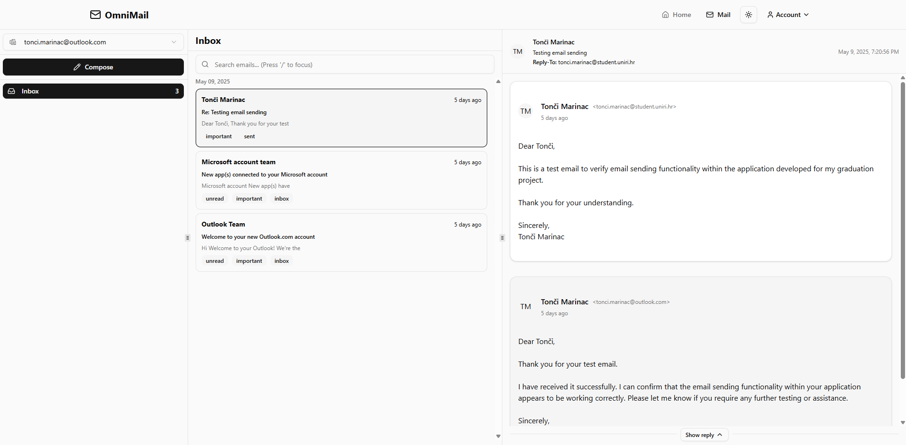

# OmniMail – AI-Powered Email Management App
OmniMail is a full-stack web application designed to simplify email composition and management. Leveraging AI capabilities, it enables users to generate and autocomplete emails using natural language prompts. Built with Next.js, TypeScript, Tailwind CSS, and Prisma, OmniMail offers a modern and efficient user experience.

## Live Demo
Experience the application live at: [https://omni-mail-tm.vercel.app](https://omni-mail-tm.vercel.app)



## Features
- **AI-Powered Email Composition:** Generate and autocomplete emails using natural language prompts.
- **User Authentication:** Secure sign-in and sign-up functionalities.
- **Responsive Design:** Optimized for various devices, ensuring a seamless experience across desktops and mobile devices.
- **Modern UI/UX:** Crafted with Tailwind CSS for a sleek and intuitive interface.
- **Database Integration:** Utilizes Prisma ORM with PostgreSQL hosted on Neon for efficient data management.

## Tech Stack
- Frontend: Next.js, TypeScript, Tailwind CSS
- Backend: Next.js API Routes, Prisma ORM, PostgreSQL
- AI Integration: Incorporates AI models for email generation and autocomplete features.
- Deployment: Vercel, Neon
- LLM model: Gemini 2.0 Flash

## Getting Started
### Prerequisites
- Node.js v18 or higher
- npm or yarn
- New Neon project

### Installation
Clone the repository:

```bash
git clone https://github.com/marinactonci/OmniMail.git
cd OmniMail
```

Install dependencies:

```bash
npm install
# or
yarn install
```

## Configure environment variables:

Create a `.env` file in the root directory and add your configuration like so:

```env
DATABASE_URL=""

BETTER_AUTH_SECRET=""

GOOGLE_CLIENT_ID=""
GOOGLE_CLIENT_SECRET=""
GITHUB_CLIENT_ID=""
GITHUB_CLIENT_SECRET=""

NEXT_PUBLIC_URL=http://localhost:3000

AURINKO_CLIENT_ID=""
AURINKO_CLIENT_SECRET=""
AURINKO_SIGNING_SECRET=""

GEMINI_API_KEY=""
```

Set up the database:

```bash
npx prisma migrate dev
```

Run the development server:

```bash
npm run dev
# or
yarn dev
```

The application will be available at `http://localhost:3000`.

## Project Structure
```bash
├── app             # Application routes and pages
├── components      # Reusable UI components
├── hooks           # Custom React hooks
├── schemas         # Validation schemas
├── server          # Backend logic and API routes
├── public          # Static assets
├── styles          # Global styles
├── .env.example    # Example environment variables
├── docker-compose.yml # Docker configuration
└── ...
```
